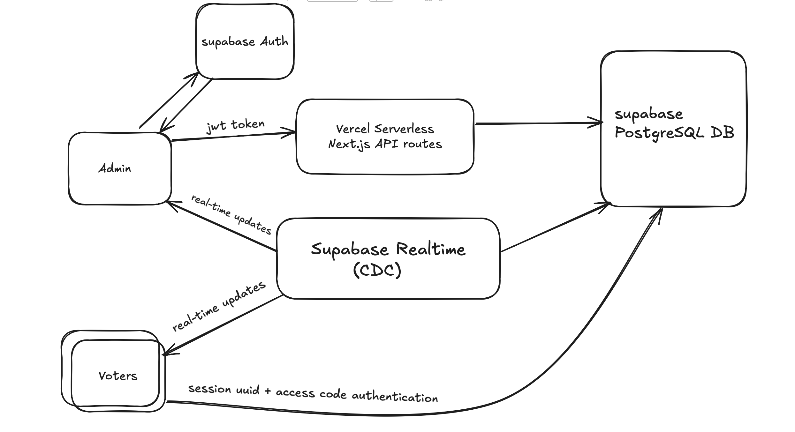
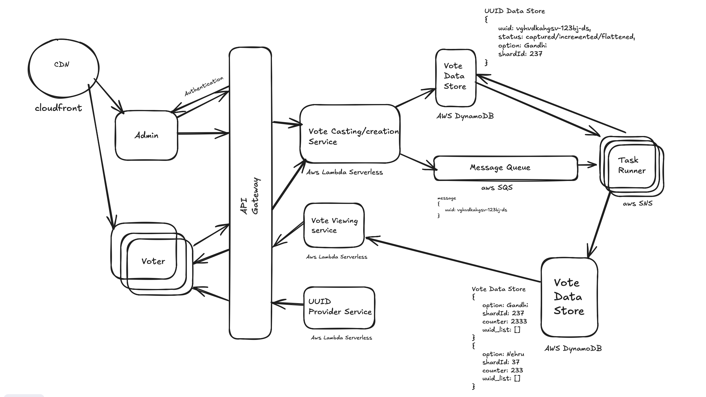

# PollSync - Real-time Opinion Polling System

**🌐 Live Demo:** [https://poll-sync.vercel.app](https://poll-sync.vercel.app)

A modern, real-time polling application built with Next.js, Supabase, and shadcn/ui. Create polls, share access codes, and watch results update live!

## Features

✨ **Admin Features**
- Secure email/password authentication
- Create polls with multiple options
- Drag-and-drop to reorder poll options
- Auto-generated secure access codes
- Real-time results dashboard with charts
- View voter names and voting history
- Delete polls

🗳️ **Voter Features**
- No registration required - just use an access code
- Simple voting interface
- Real-time results visualization
- Bar chart and pie chart views
- Prevention of duplicate votes per device

🎨 **Design**
- Modern dark theme with blue accents
- Fully responsive mobile-first design
- Beautiful charts using Recharts
- Smooth animations and transitions

## Tech Stack

- **Frontend:** Next.js 15, React, TypeScript, Tailwind CSS
- **UI Components:** shadcn/ui
- **Backend:** Next.js API Routes
- **Database:** Supabase (PostgreSQL)
- **Authentication:** Supabase Auth
- **Real-time:** Supabase Realtime
- **Charts:** Recharts
- **Deployment:** Vercel

## Usage

### For Admins

1. **Sign Up/Login**
   - Click "Create a Poll" on the homepage
   - Sign up with email and password
   - Confirm your email (check Supabase settings for local development)

2. **Create a Poll**
   - Click "Create New Poll" from dashboard
   - Enter poll title and optional description
   - Add at least 2 options
   - Drag to reorder options
   - Submit to generate an access code

3. **Share the Code**
   - Copy the generated access code (e.g., AB12-34)
   - Share it with your audience

4. **View Results**
   - Watch votes come in real-time
   - Toggle between bar and pie charts
   - See who voted and what they selected

### For Voters

1. **Enter Code**
   - Click "I Have a Code" on homepage
   - Enter the access code you received

2. **Vote**
   - Enter your name
   - Select your choice
   - Submit your vote

3. **View Results**
   - See live results after voting
   - Watch as others vote in real-time

## Project Structure

```
pollsync/
├── src/
│   ├── app/
│   │   ├── admin/              # Admin pages
│   │   │   ├── login/          # Admin authentication
│   │   │   ├── new/            # Create new poll
│   │   │   ├── poll/[pollId]/  # Admin poll results
│   │   │   └── page.tsx        # Admin dashboard
│   │   ├── api/                # API routes
│   │   │   ├── polls/create/   # Create poll endpoint
│   │   │   ├── polls/[pollId]/vote/ # Vote endpoint
│   │   │   └── codes/verify/   # Code verification
│   │   ├── poll/[pollId]/results/ # Public results page
│   │   ├── vote/               # Voting pages
│   │   │   ├── [pollId]/       # Vote submission
│   │   │   └── page.tsx        # Code entry
│   │   ├── layout.tsx          # Root layout
│   │   └── page.tsx            # Landing page
│   ├── components/             # React components
│   │   ├── ui/                 # shadcn/ui components
│   │   ├── navbar.tsx          # Navigation bar
│   │   └── sortable-option.tsx # Drag-drop option
│   └── lib/
│       ├── supabase/           # Supabase client & auth
│       ├── types.ts            # TypeScript types
│       └── utils/              # Utility functions
└── public/                     # Static assets
```

## Database Schema

### polls
- `id` - UUID (Primary Key)
- `admin_id` - UUID (Foreign Key to auth.users)
- `title` - Text
- `description` - Text (nullable)
- `created_at`, `updated_at` - Timestamps

### poll_options
- `id` - UUID (Primary Key)
- `poll_id` - UUID (Foreign Key)
- `option_text` - Text
- `option_order` - Integer
- `created_at` - Timestamp

### access_codes
- `id` - UUID (Primary Key)
- `poll_id` - UUID (Foreign Key)
- `code_hash` - Text (Unique, hashed)
- `code_display` - Text (Unique, plain format)
- `is_active` - Boolean
- `created_at` - Timestamp

### votes
- `id` - UUID (Primary Key)
- `poll_id` - UUID (Foreign Key)
- `option_id` - UUID (Foreign Key)
- `voter_uuid` - UUID
- `voter_name` - Text
- `voted_at` - Timestamp
- Unique constraint on `(poll_id, voter_uuid)`

## Security Features

- ✅ Row Level Security (RLS) enabled on all tables
- ✅ Hashed access codes using HMAC-SHA256
- ✅ Session-based voter identification
- ✅ Duplicate vote prevention
- ✅ Admin-only poll creation and management
- ✅ Secure API routes with authentication checks

## Architecture

### Current Architecture (Supabase + Vercel)



The current implementation uses a modern serverless architecture with Supabase and Vercel:

- **Frontend**: Next.js hosted on Vercel
- **Database**: Supabase PostgreSQL with real-time capabilities
- **Authentication**: Supabase Auth for admin login
- **Real-time**: Supabase Realtime (CDC) for live updates
- **API**: Next.js API routes on Vercel serverless functions

### Scalable Production Architecture (AWS)



For high-scale production deployments, the system can be migrated to AWS with:

- **CDN**: CloudFront for global content delivery
- **API Gateway**: Centralized API management
- **Serverless Functions**: AWS Lambda for vote processing
- **Database**: DynamoDB for high-performance data storage
- **Message Queue**: SQS for asynchronous processing
- **Notifications**: SNS for real-time updates
- **UUID Management**: Dedicated service for voter identification

## Features in Detail

### Real-time Updates
- Uses Supabase Realtime subscriptions
- Results update instantly when new votes come in
- Works for both admin and public result pages

### Drag-and-Drop Options
- Built with @dnd-kit/core and @dnd-kit/sortable
- Smooth animations and touch support
- Reorder poll options before creating

### Vote Prevention
- Each device gets a unique UUID stored in localStorage
- Server-side validation prevents duplicate votes
- Unique database constraint as backup

### Chart Visualizations
- Interactive bar and pie charts
- Percentage calculations
- Color-coded options

## Troubleshooting

### "Unauthorized" error when creating polls
- Make sure you're logged in as an admin
- Clear browser cookies and log in again
- Check Supabase email confirmation status


Built with ❤️ using Next.js, Supabase, and shadcn/ui
